<div align="center">

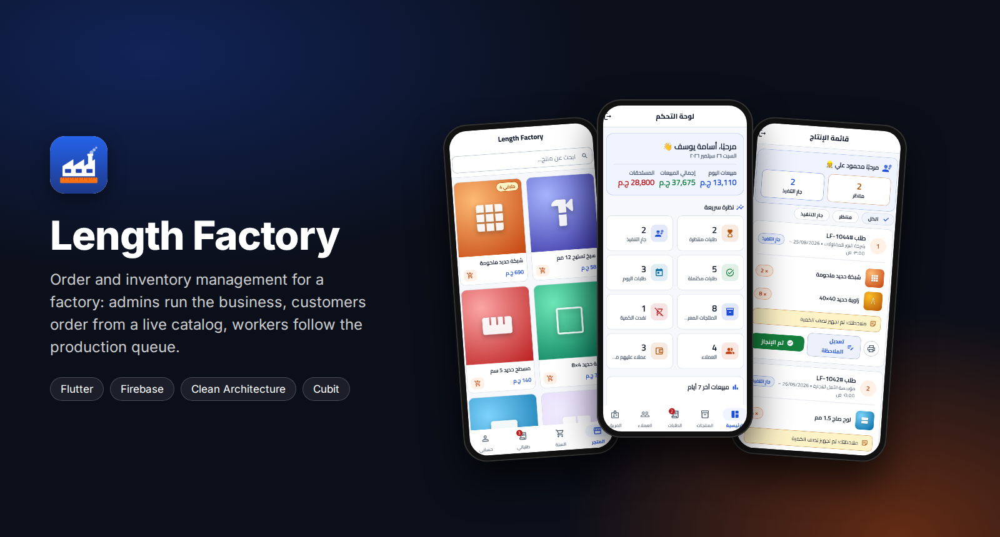

<br/>

[](https://flutter.dev)
[](https://dart.dev)
[](https://firebase.google.com)
[](#getting-started)
[](LICENSE)

**Order and inventory management for a manufacturing business.**
Admins run products, orders, customers and payments. Customers order from a live catalog.
Workers see only the production queue, never a price.

نظام إدارة مصنع وطلبات — واجهة عربية كاملة (RTL) لثلاثة أدوار: مدير، عميل، وعامل إنتاج.

[Overview](#overview) · [Screenshots](#screenshots) · [Features](#features) · [Architecture](#architecture) · [Getting started](#getting-started)

</div>

---

## Overview

Length Factory replaces phone calls and paper order books with one app that everyone in the
business uses. The same codebase runs on Android phones for customers and workers, and on
Windows for the office.

| Role | What they do in the app |
|:--|:--|
| **Admin** | Live dashboard, product catalog and stock, every order, customer balances and payments, staff accounts |
| **Customer** | Browse the catalog, add to cart, check out on account, follow orders and see their balance |
| **Worker** | A first-in, first-out production queue with start / finish actions and private notes. No prices, no balances |

Every money or stock change (checkout, payment, cancellation, deletion) runs inside a single
Firestore transaction, so a customer's balance and the stock count can never drift apart.

## Screenshots

> Captured from the running app with sample data.

### Admin

<table>
  <tr>
    <td align="center">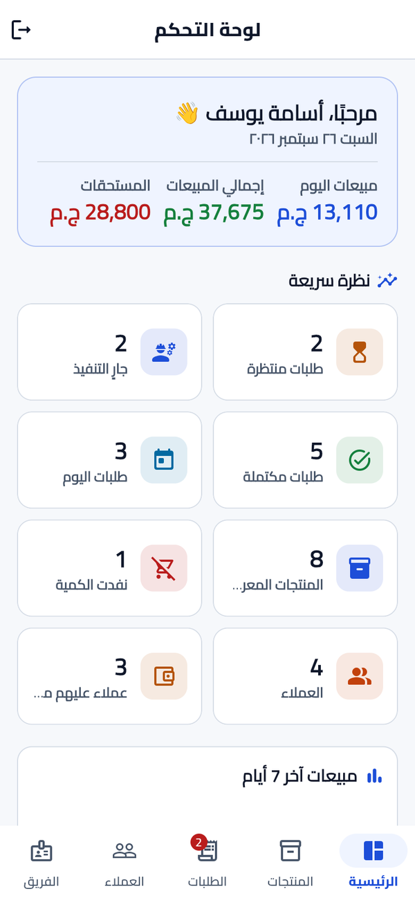<br/><sub><b>Dashboard</b><br/>Sales, dues and quick stats</sub></td>
    <td align="center">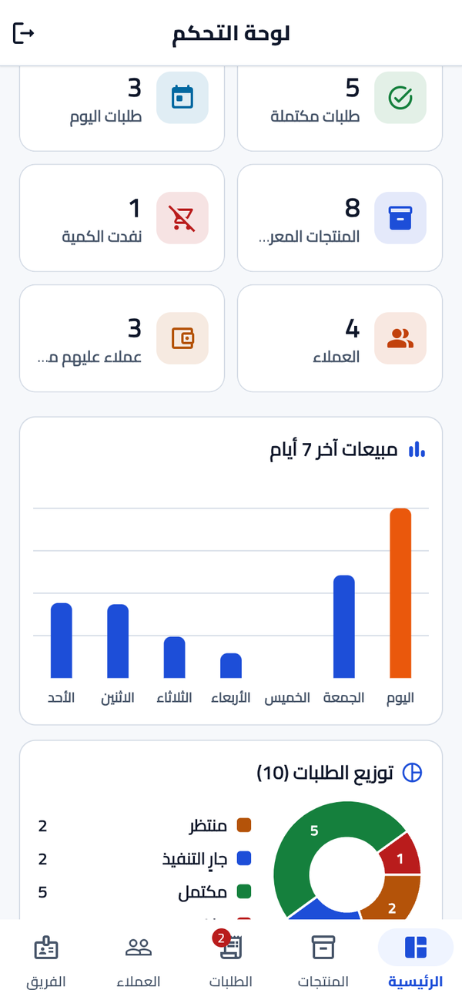<br/><sub><b>Charts</b><br/>7-day sales and order status</sub></td>
    <td align="center">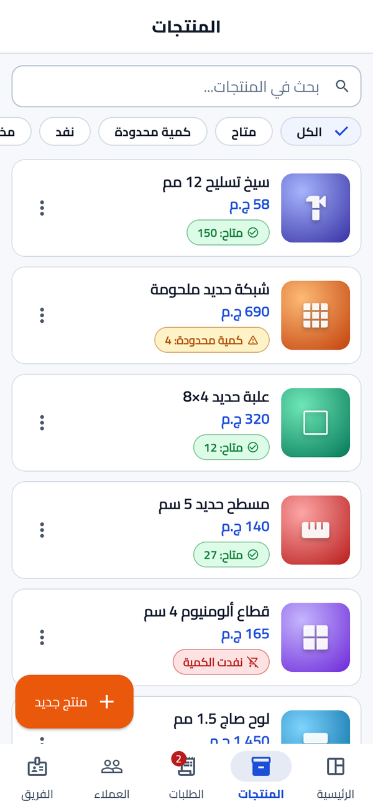<br/><sub><b>Products</b><br/>Stock filters and low-stock badges</sub></td>
    <td align="center">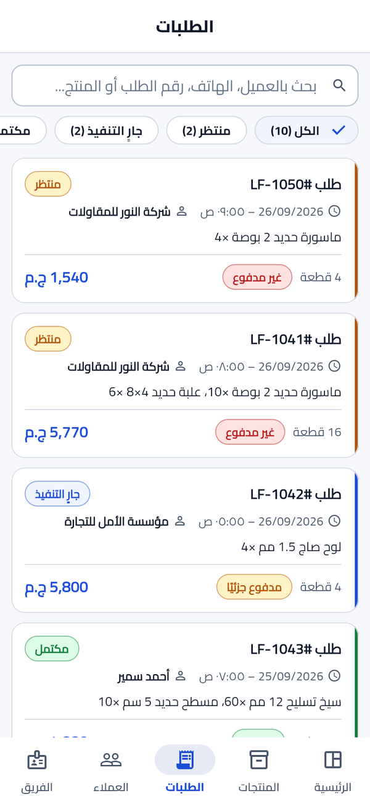<br/><sub><b>Orders</b><br/>Search, status and payment filters</sub></td>
  </tr>
  <tr>
    <td align="center">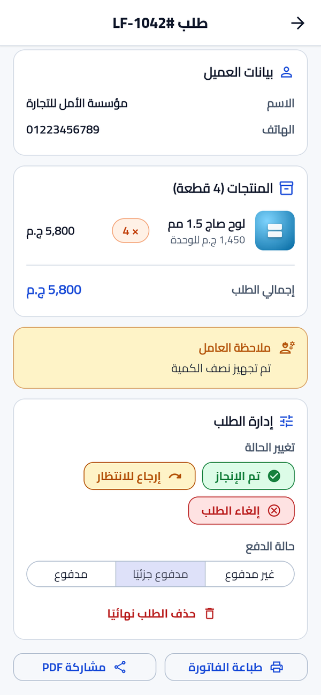<br/><sub><b>Order details</b><br/>Status flow, payment state, PDF invoice</sub></td>
    <td align="center">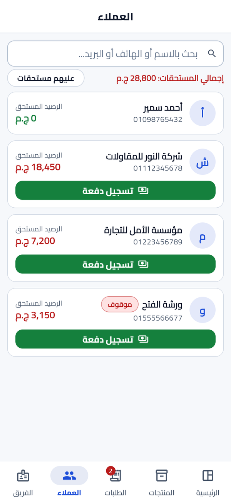<br/><sub><b>Customers</b><br/>Balances and one-tap payments</sub></td>
    <td align="center">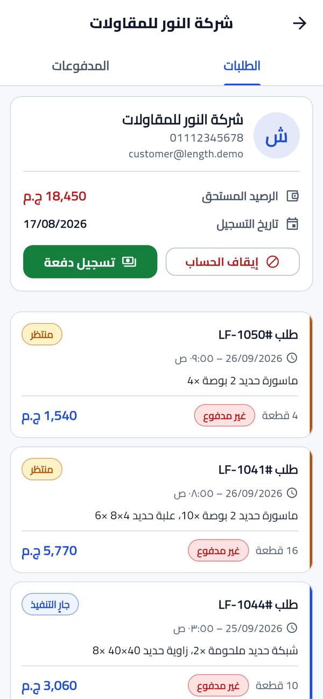<br/><sub><b>Customer account</b><br/>Orders, payments, activate / suspend</sub></td>
    <td align="center">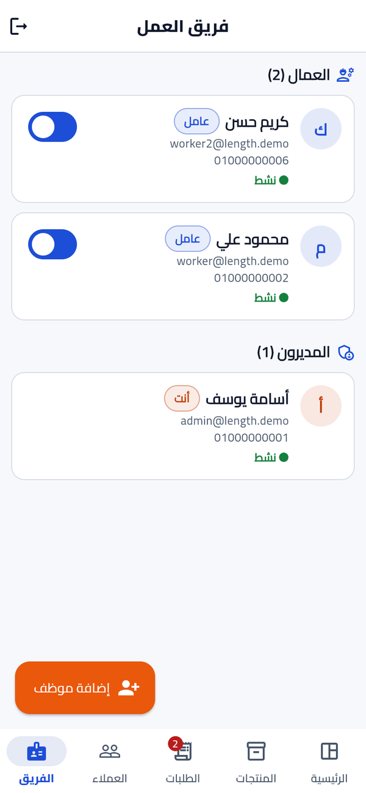<br/><sub><b>Team</b><br/>Create and disable staff accounts</sub></td>
  </tr>
</table>

### Customer and worker

<table>
  <tr>
    <td align="center">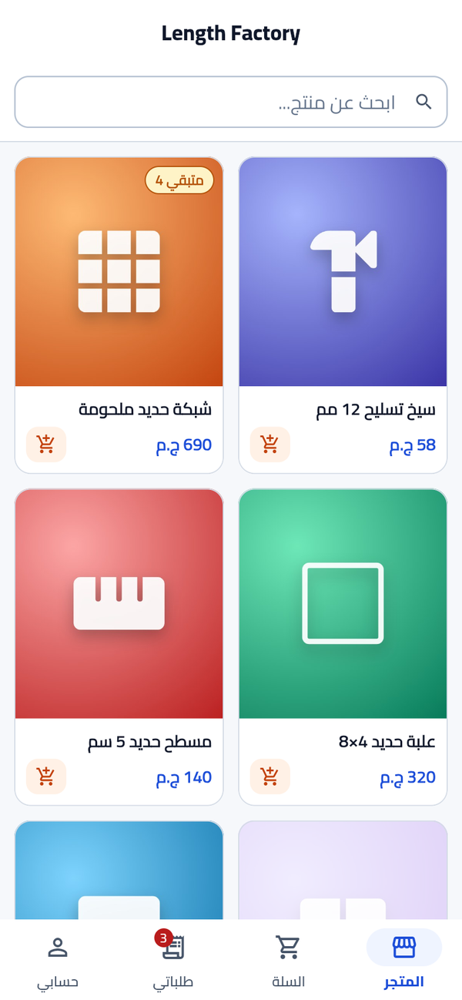<br/><sub><b>Store</b><br/>Live search and stock badges</sub></td>
    <td align="center"><br/><sub><b>Product</b><br/>Quantity capped by available stock</sub></td>
    <td align="center">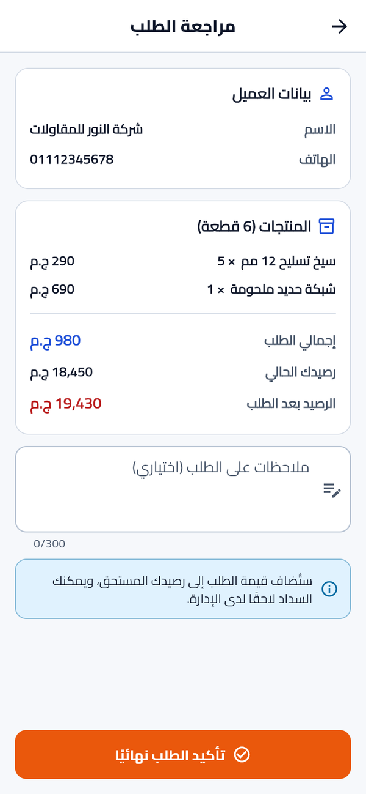<br/><sub><b>Checkout</b><br/>Balance before and after the order</sub></td>
    <td align="center">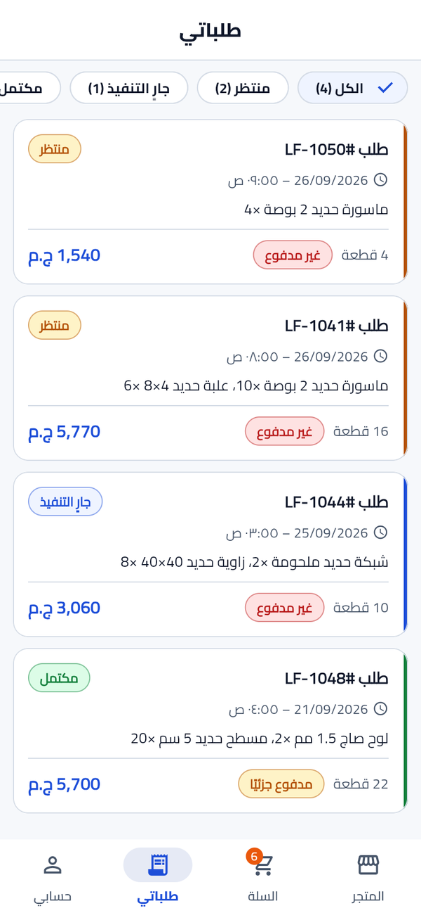<br/><sub><b>My orders</b><br/>Filter by status</sub></td>
  </tr>
  <tr>
    <td align="center">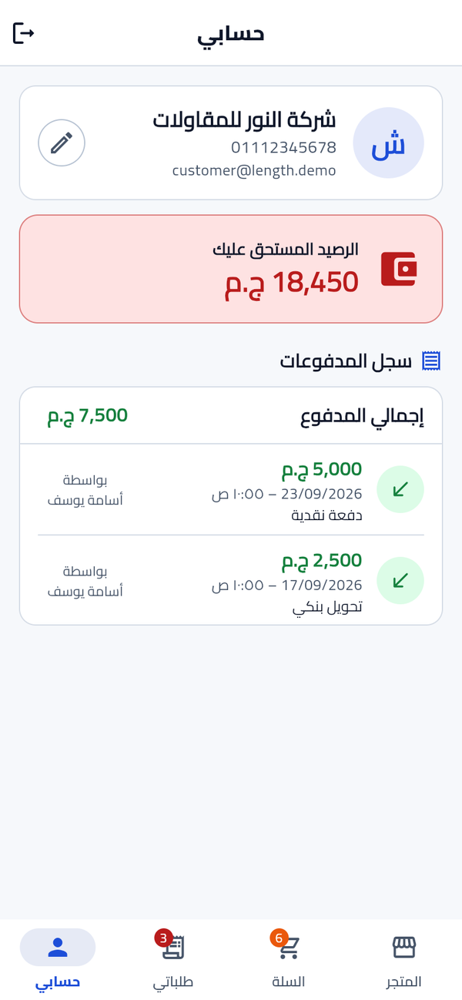<br/><sub><b>Account</b><br/>Balance and payment history</sub></td>
    <td align="center">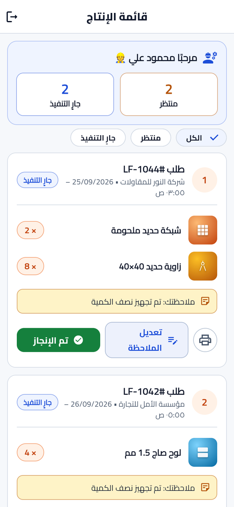<br/><sub><b>Worker queue</b><br/>Start, finish, add a note, print</sub></td>
    <td align="center">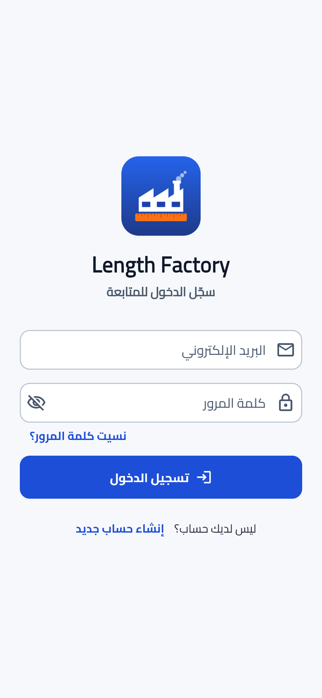<br/><sub><b>Sign in</b><br/>Role-based routing after login</sub></td>
    <td></td>
  </tr>
</table>

### Windows

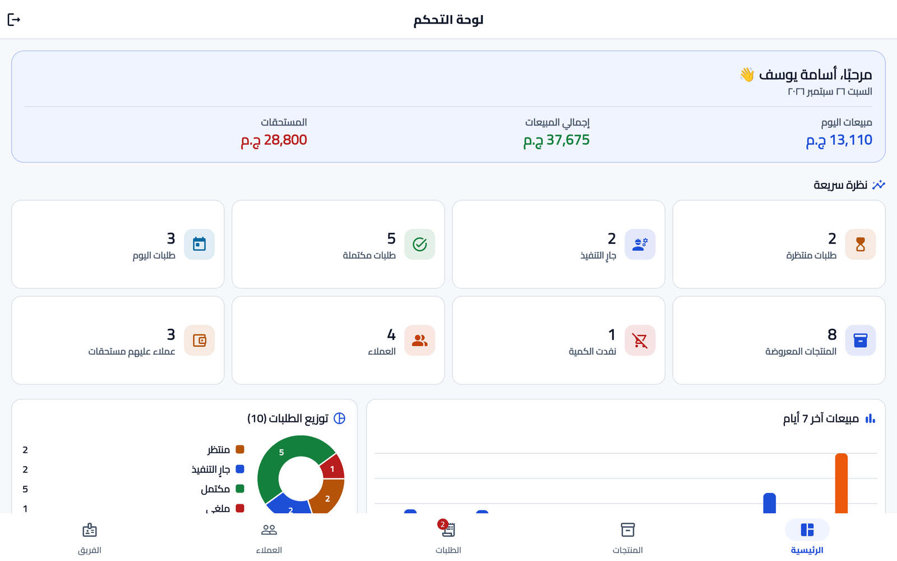

## Features

**Authentication and access**
- Email / password sign-in with password reset
- Automatic routing to the Admin, Customer or Worker shell based on the user's role
- Suspended accounts are signed out immediately and cannot sign back in
- Customers register themselves; Admin and Worker accounts are created by an admin without logging the admin out
- Firestore security rules enforce every permission at the database level, not only in the UI

**Admin**
- Dashboard: today's and total sales, outstanding dues, order counters, low-stock alerts, 7-day sales bar chart, order status pie chart
- Products: add, edit, hide and restore; image upload to Cloudinary; filters for available, low, out of stock and hidden
- Orders: search, status and payment filters with counts, status flow, payment status, delete, PDF invoice (print or share)
- Cancelling or deleting an order reverses it completely: the amount leaves the customer's balance and the stock comes back, atomically
- Customers: balances, record payments, payment history, order history, activate / deactivate
- Team: create Worker or Admin accounts and switch them on or off

**Customer**
- Responsive product grid with live search and stock badges
- Product page with live price and stock; the quantity picker cannot exceed what is available
- Cart that stays in sync with the catalog (price changes, stock, hidden products)
- Checkout on account showing the balance before and after, with an optional note
- Order list with status filter, order details and PDF invoice
- Account page with live balance, editable name and phone, and payment history

**Worker**
- Production queue of pending and in-progress orders, oldest first, with counters
- Start / finish with confirmation
- Private notes that only the admin can read, and a printable work order without prices

## Roles and permissions

| Capability | Admin | Customer | Worker |
|:--|:-:|:-:|:-:|
| Manage products | ✅ | – | – |
| View products | ✅ | ✅ | ✅ name and quantity only |
| Place orders | – | ✅ | – |
| View orders | ✅ all | ✅ own | ✅ active only |
| See prices and balances | ✅ | ✅ own | never |
| Record payments | ✅ | – | – |
| Change order status | ✅ | – | ✅ start / finish |
| Cancel or delete orders | ✅ | – | – |
| Worker notes | read | – | write |
| Manage customers and staff | ✅ | – | – |

## Tech stack

| Area | Choice |
|:--|:--|
| Framework | Flutter, Dart |
| Architecture | Clean Architecture, feature-first (`data` / `domain` / `presentation`) |
| State management | Cubit (`flutter_bloc`) |
| Dependency injection | `get_it` |
| Error handling | `dartz` `Either<Failure, T>` returned from every use case |
| Backend | Firebase Authentication, Cloud Firestore |
| Images | Cloudinary REST upload through `dio`, cached with `cached_network_image` |
| Navigation | `go_router` with a role-based redirect driven by `AuthCubit` |
| Charts | `fl_chart` |
| Invoices | `pdf` + `printing` |
| UI | Material 3, Cairo font (`google_fonts`), full RTL |
| Tests | `flutter_test`, `bloc_test`, `mocktail`, `fake_cloud_firestore` |

## Architecture

Each feature is split into three layers, and dependencies only point inwards:
**Presentation → Domain ← Data**.

```
┌──────────────────────────── PRESENTATION ────────────────────────────┐
│  Screens / widgets  ──►  Cubits                                      │
│  OrdersCubit, CheckoutCubit, CartCubit, AuthCubit, ...               │
└──────────────────────────────────┬───────────────────────────────────┘
                                   │ calls
┌──────────────────────────────── DOMAIN ──────────────────────────────┐
│  Use cases   PlaceOrderUseCase, RecordPaymentUseCase, ...            │
│  Entities    UserEntity, ProductEntity, OrderEntity, ...             │
│  Repository contracts (abstract)            pure Dart, no Firebase   │
└──────────────────────────────────▲───────────────────────────────────┘
                                   │ implements
┌───────────────────────────────── DATA ───────────────────────────────┐
│  Repository implementations   exceptions ➜ Either<Failure, T>        │
│  Remote data sources          Firestore transactions, FirebaseAuth   │
│  Models (toMap / fromMap) · services (Cloudinary upload, PDF)        │
└──────────────────────────────────────────────────────────────────────┘
                    Wiring: GetIt  (lib/core/di/injection.dart)
```

Key decisions:

- **The domain layer has no Firebase imports.** Status flow, validation and dashboard math are unit-tested without emulators.
- **Atomic transactions** for checkout, payments, cancellation and deletion.
- **Real-time everywhere.** Cubits listen to Firestore streams, so a customer's balance updates the moment an admin records a payment.
- **Soft deletes for products**, so old orders keep showing the right name and price.
- **Order items are snapshots** of the product at order time.
- Screen-level Cubits are GetIt factories closed by `BlocProvider`; `AuthCubit` and `CartCubit` are app-wide singletons.

<details>
<summary><b>Project structure</b></summary>

```
lib/
├── core/
│   ├── constants/     collections, roles, statuses, Cloudinary config
│   ├── cubit/         SubmissionState, LoadStatus, SafeEmit mixin
│   ├── di/            GetIt registrations
│   ├── errors/        exceptions, failures, exception → failure mapper
│   ├── network/       Dio client and error mapping
│   ├── routing/       AppRouter (go_router) and role redirects
│   ├── services/      image upload (Cloudinary)
│   ├── theme/         colors and theme
│   ├── usecase/       UseCase / StreamUseCase base classes
│   ├── utils/         formatting, validators, stream helpers
│   └── widgets/       shared widgets
├── features/
│   ├── auth/          session, login, register, splash
│   ├── products/      catalog, admin product management, storefront
│   ├── cart/          cart
│   ├── orders/        checkout, order lists, details, worker queue, PDF invoice
│   ├── accounts/      customers, payments, staff, customer profile
│   ├── dashboard/     stats and charts
│   └── shell/         Admin / Customer / Worker navigation shells
├── app.dart
├── firebase_options.dart
└── main.dart
```
</details>

<details>
<summary><b>Firestore data model</b></summary>

**`users/{uid}`**
```json
{ "name": "string", "phone": "string", "email": "string",
  "role": "admin | customer | worker", "balance": 0.0,
  "createdAt": "timestamp", "isActive": true }
```

**`products/{id}`**
```json
{ "name": "string", "nameLower": "string", "image": "string (URL)",
  "price": 0.0, "description": "string", "quantity": 0,
  "createdAt": "timestamp", "isActive": true }
```

**`orders/{id}`**
```json
{ "orderNumber": "string", "customerId": "uid", "customerName": "snapshot", "phone": "snapshot",
  "items": [ { "productId": "string", "productName": "snapshot", "productImage": "snapshot",
               "unitPrice": 0.0, "quantity": 0 } ],
  "totalPrice": 0.0,
  "status": "pending | preparing | completed | cancelled",
  "paymentStatus": "unpaid | partially_paid | paid",
  "workerNote": "admin-visible only", "customerNote": "string | null",
  "createdAt": "timestamp", "completedAt": "timestamp | null" }
```

**`payments/{id}`**
```json
{ "customerId": "uid", "amount": 0.0, "date": "timestamp",
  "adminId": "string", "adminName": "string", "notes": "string | null" }
```
</details>

<details>
<summary><b>Security rules (highlights)</b></summary>

| Rule | How |
|:--|:--|
| A customer can only create orders for themselves | `customerId == request.auth.uid` |
| A customer cannot change their own role | `request.resource.data.role == resource.data.role` |
| A worker can only update `status`, `completedAt`, `workerNote` | `affectedKeys().hasOnly([...])` |
| A worker cannot read `payments` | no rule granted |
| A customer can only decrease product `quantity` | `quantity < resource.data.quantity && quantity >= 0` |
</details>

## Getting started

**Requirements:** Flutter 3.24+, a Firebase project, Node.js with the Firebase CLI.

```bash
git clone https://github.com/osama-Yosef/length-factory.git
cd length-factory
flutter pub get

# Connect your Firebase project (generates lib/firebase_options.dart)
dart pub global activate flutterfire_cli
flutterfire configure

# Deploy rules and indexes
firebase deploy --only firestore:rules,firestore:indexes

flutter run                 # Android
flutter run -d windows      # Windows
```

- **Images:** create an unsigned Cloudinary upload preset named `length_factory` and set your cloud name in `lib/core/constants/app_constants.dart`.
- **First admin:** register from the app (this creates a customer), change `role` to `"admin"` on that user's document in Firestore, then sign in again.
- **Windows build:** set `$env:CMAKE_POLICY_VERSION_MINIMUM="3.5"` before `flutter run -d windows`.

Run the tests with `flutter test`.

## Roadmap

- [x] Clean Architecture foundation, Firebase, auth and role routing
- [x] Admin panel: dashboard, products, orders, customers and payments
- [x] Customer panel: store, cart, checkout, orders, account
- [x] Worker panel: production queue, status updates, notes
- [x] Staff management, full order reversal, charts, PDF invoices
- [ ] Push notifications (FCM)
- [ ] Excel customer reports and a QR code per order
- [ ] Cloud Functions for server-side validation

## Author

**Osama Yosef** · Flutter developer, Cairo

[](https://github.com/osama-Yosef)
[](https://www.linkedin.com/in/osama-yosef-819268319)
[](https://upwork.com/freelancers/~014ebd205ef38ca04c)
[](mailto:osamayosef038@gmail.com)

Released under the [MIT License](LICENSE).
